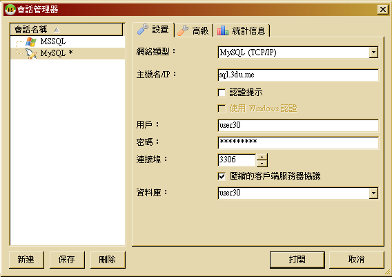

## 實作零

## 準備實作環境

* 我們的實驗環境如下圖所示。
* 

* <備註> Etu Virtual Appliance 2.0 的 Master 與 Worker 均只有連結於 Host-Only Virtual Network 上，因此如果要讓 Master 跟 Worker VM 都可以連線網際網路的話，Linux 使用者可以在 Virtual Box 的環境中，以 root 或 sudo 身份執行以下指令：
<pre>
echo 1 > /proc/sys/net/ipv4/ip_forward
iptables -t nat -A POSTROUTING -s 192.168.70.0/24 -j MASQUERADE
</pre>

### Hadoop Cluster VMs

首先，我們需要架設一組 Hadoop 叢集。

這裡筆者挑選的工具是 [Etu Virtual Appliance (EVA)](http://www.etusolution.com/index.php/tw/download/eva/eva-installation-tw)，因為它能簡單而快速地架設好一組 Hadoop 叢集(最多 1 Master + 5 Worker)。以下我們示範如何將 [EVA](http://www.etusolution.com/index.php/tw/download/eva/eva-installation-tw) 安裝在 Windows 環境中。

 1. 請先檢查 [官方網站所列之系統需求](http://www.etusolution.com/index.php/tw/download/eva/eva-download-tw)
    * 確認您要執行的硬體環境 CPU 是否支援虛擬化技術(Intel VT-x 或 AMD-V)，並且至少 10GB 的系統記憶體 (一個 Master 節點和一個 Worker 節點的配置).
    * 確認您的 Windows 環境是 64 位元作業系統 ( 32 位元作業系統即使安裝了 VirtualBox，仍將無法模擬 64 位元 )
    * 安裝 [VirtualBox](https://www.virtualbox.org/wiki/Downloads) 跟 [VirtualBox Extension Pack](https://www.virtualbox.org/wiki/Downloads)
 1. 下載 Etu Virtual Appliance 的壓縮檔：整體大小約為 2.8 GB。
    * 請將 [Etu Virtual Appliance 2.0 版](http://bit.ly/EVA_20) 另存新檔。
 1. 若您在 Windows 平台下無法解壓縮 .tar.gz (.tgz) 格式，請一併下載 [7-zip](http://www.7-zip.org/)
    * 請將 [7-zip 9.20 版](http://downloads.sourceforge.net/sevenzip/7z920.exe) 另存新檔。
 1. 使用 7-zip 將 Etu_Virtual_Appliance_2.0.tgz 解壓縮
    * 
 1. 後續的步驟，請參考 [官方網站的步驟](http://www.etusolution.com/index.php/tw/download/eva/eva-installation-tw)
    * 請確定在 Windows 環境下，[VirtualBox 的虛擬網卡是否正確完成設定](http://www.etusolution.com/index.php/tw/download/eva/eva-installation-tw#windows)，並完成 VM 檔案的匯入 
    * 請依 [官方網站的步驟](http://www.etusolution.com/index.php/tw/download/eva/eva-configuration-tw)，依序啟動 Master Node、同意授權、上傳授權檔案、設定 Etu Virtual Appliance、檢視設定、登入 Etu Virtual Appliance、啟動 Worker Node、建立使用者帳號。以下，我們將假定您設定的使用者帳號為 **user**。

### SSH Client

其次，我們需要一個 SSH Client，用來連上 [Etu Virtual Appliance (EVA)](http://www.etusolution.com/index.php/tw/download/eva/eva-installation-tw)

這裡筆者挑選的工具是 [PieTTY](http://ntu.csie.org/~piaip/pietty/)

1. 下載 PieTTY 免安裝版本
    * 您可以至以下網址下載最新版本： http://ntu.csie.org/~piaip/pietty/
    * 或者按下滑鼠右鍵，將 [0.3.27 版](http://ntu.csie.org/~piaip/pietty/archive/pietty0327.exe) 另存新檔，儲存於桌面。
1. 嘗試連線至 [Etu Virtual Appliance (EVA)](http://www.etusolution.com/index.php/tw/download/eva/eva-overview-tw) 的 Master 虛擬機器(若您有根據設定步驟正確設定，則 IP 位址應為 192.168.70.10)
    * 
1. 由於後續我們將使用到網際網路進行 SQL Server 的資料匯入與匯出，也將從 github.com 下載範例資料集，因此請檢驗是否可以正常連線網際網路。
    * 
    * 請輸入指令： 
<pre>ping -c 1 github.com</pre>

### SQL Client

接著，我們需要下載一個可以連結微軟 SQL Server，以及 MySQL Server 的資料庫用戶端程式。

這裡筆者挑選的工具是 [HeidiSQL](http://www.heidisql.com/)

1. 下載 HeidiSQL Portable 版本
    * 您可以至以下網址下載最新版本： http://www.heidisql.com/download.php
    * 或者按下滑鼠右鍵，將 [HeidiSQL 8.2 可攜版](http://www.heidisql.com/downloads/HeidiSQL_8.2_Portable.zip) 另存新檔，儲存於桌面。
1. 將下載的 zip 壓縮檔，解壓縮到桌面。
1. 執行 heidisql.exe 執行檔，並進行以下兩組資料庫的設定。
    * 
1. 讓我們先來測試 Microsoft SQL Server 的連線是否正常。
    * 
    * 上圖中，請依講師分配之學員帳號密碼，修改 **userXX** (XX 為數字)
1. 接著，讓我們建立一個 Microsoft SQL Server 的示範資料表 **MSSQL_DATA**。
    * 
    * 請先輸入以下 SQL 語法，並按下「查詢」按鈕，產生 MSSQL_DATA 資料表
<pre>
CREATE TABLE MSSQL_DATA (id int primary key, name varchar(50));
INSERT INTO MSSQL_DATA VALUES (1, 'Hello');
INSERT INTO MSSQL_DATA VALUES (2, 'World');
</pre>
1. 讓我們先來測試 MySQL Server 的連線是否正常。
    * 
    * 上圖中，請依講師分配之學員帳號密碼，修改 **userXX** (XX 為數字)
1. 接著，讓我們建立一個 MySQL Server 的示範資料表 **mysql_data**。
    * 
    * 請先輸入以下 SQL 語法，並按下「查詢」按鈕，產生 mysql_data 資料表
<pre>
CREATE TABLE mysql_data (id int primary key, name varchar(50));
INSERT INTO mysql_data VALUES (1, 'Hello');
INSERT INTO mysql_data VALUES (2, 'World');
</pre>

--------------------
本文件最後更新於：
