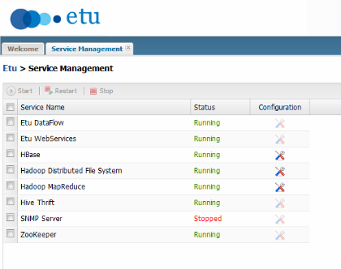

## 實作一

## Sqoop (1) : 將 MS SQL 資料表匯出到 HDFS

### 連線至 EVA

首先，請使用 SSH Client (Ex. [PieTTY](http://ntu.csie.org/~piaip/pietty/)) 連進 EVA 的 Master 虛擬機器。(若您是參考官方步驟進行設定，則 IP 位址應為 192.168.70.10)

1. 嘗試連線至 [Etu Virtual Appliance (EVA)](http://www.etusolution.com/index.php/tw/download/eva/eva-overview-tw) 的 Master 虛擬機器(若您有根據設定步驟正確設定，則 IP 位址應為 192.168.70.10)
    * 

### 確認 HDFS 與 MapReduce 服務狀態

1. 由於後續的實作會用到 HDFS 跟 MapReduce，因此請先確認 HDFS 與 MapReduce 的狀態是正常運作中。以 Etu Virtual Appliance 為例，您可以連線至 <http://192.168.70.10:50070> 跟 <http://192.168.70.10:50030> 確認 NameNode 與 JobTracker 的狀態。或者從 <http://192.168.70.10/login.html> 登入管理介面 ( 帳號: admin / 密碼: etuadmin )，點選 Service Management (如下圖)。
    * 

### 執行記錄匯出

1. 請輸入指令： **sqoop version**
<pre>
user@master ~ $ sqoop version
Sqoop 1.4.1-cdh4.1.2
git commit id
Compiled by jenkins on Thu Nov  1 18:16:12 PDT 2012
</pre>
1. 請輸入如下指令並將「帳號」處替換成您的帳號：
<pre>
## 以下兩行為防止錯誤結果的檢查指令 
user@master ~ $ hadoop fs -ls
user@master ~ $ hadoop fs -rmr mysql_data MSSQL_DATA
## 進行匯入
user@master ~ $ export DBID=帳號
user@master ~ $ sqoop import --connect "jdbc:sqlserver://sql.3du.me:1433;database=$DBID" --table MSSQL_DATA --username $DBID -P
Enter password: 輸入密碼
</pre>
1. 若資料轉換有正常執行，您將看到以下的類似訊息：
<pre>
13/12/22 10:12:31 INFO hdfs.DFSClient: Created HDFS_DELEGATION_TOKEN token 13 for user on 192.168.70.10:9000
13/12/22 10:12:31 INFO security.TokenCache: Got dt for hdfs://master.etusolution.com:9000;uri=192.168.70.10:9000;t.service=192.168.70.10:9000
13/12/22 10:12:31 INFO hdfs.DFSClient: Created HDFS_DELEGATION_TOKEN token 14 for user on 192.168.70.10:9000
13/12/22 10:12:31 INFO security.TokenCache: Got dt for hdfs://master.etusolution.com:9000/var/disk/a/hadoop/tmp/hadoop-etu/mapred/staging/user/.staging/job_201312211330_0007/libjars/ant-eclipse-1.0-jvm1.2.jar;uri=192.168.70.10:9000;t.service=192.168.70.10:9000
13/12/22 10:12:34 INFO db.DataDrivenDBInputFormat: BoundingValsQuery: SELECT MIN([id]), MAX([id]) FROM [MSSQL_DATA]
13/12/22 10:12:41 INFO mapred.JobClient: Running job: job_201312211330_0007
.
.. 略 ..
.
13/12/22 10:13:07 INFO mapreduce.ImportJobBase: Transferred 0 bytes in 87.6205 seconds (0 bytes/sec)
13/12/22 10:13:07 INFO mapreduce.ImportJobBase: Retrieved 2 records.
</pre>

### 檢查結果檔案

1. 轉換之結果，可於 HDFS 取得。請檢查目錄下是否有 MSSQL_DATA 資料夾。若轉換成功，您將看到 part-m-***** 的結果檔案。
<pre>
user@master ~ $ hadoop fs -ls MSSQL_DATA
-rw-------   3 user user          0 2013-12-22 10:13 MSSQL_DATA/_SUCCESS
drwxrwxr-x   - user user          0 2013-12-22 10:12 MSSQL_DATA/_logs
-rw-------   3 user user         16 2013-12-22 10:13 MSSQL_DATA/part-m-00000
</pre>
1. 檢視 part-m-***** 轉換結果
<pre>
user@master ~ $ hadoop fs -cat MSSQL_DATA/part-m-00000
1,Hello
2,World
</pre>

### 常見問題

* <備註 1> 若轉換失敗，您將會在目前的工作目錄看到一個與資料表同名的 java 檔案。在重新執行前，請先刪除該檔案。
<pre>
user@master ~ $ rm MSSQL_DATA.java
</pre>
* 例如：當 MSSQL_DATA 資料表不存在時，會看到以下錯誤。執行 ls 的結果，會看到一個名為 MSSQL_DATA.java 的程式碼。
<pre>
user@master ~ $ sqoop import --connect "jdbc:sqlserver://sql.3du.me;database=$DBID" --table MSSQL_DATA --username $DBID -P
Enter password:
13/12/22 10:36:18 INFO manager.SqlManager: Using default fetchSize of 1000
13/12/22 10:36:18 INFO tool.CodeGenTool: Beginning code generation
13/12/22 10:36:19 INFO manager.SqlManager: Executing SQL statement: SELECT t.* FROM [MSSQL_DATA] AS t WHERE 1=0
13/12/22 10:36:19 ERROR manager.SqlManager: Error executing statement: com.microsoft.sqlserver.jdbc.SQLServerException: 無效的物件名稱 'MSSQL_DATA'。
com.microsoft.sqlserver.jdbc.SQLServerException: 無效的物件名稱 'MSSQL_DATA'。
        at com.microsoft.sqlserver.jdbc.SQLServerException.makeFromDatabaseError(SQLServerException.java:216)
.
.. 略 ..
.
13/12/22 10:36:19 ERROR tool.ImportTool: Imported Failed: Attempted to generate class with no columns!
user@master ~ $ ls
application_log  MSSQL_DATA.java
</pre>
* <備註 2> 若轉換成功，您將無法再跑第二次 sqoop import 指令。您可能會看到這樣的錯誤訊息：org.apache.hadoop.mapred.FileAlreadyExistsException: **Output directory MSSQL_DATA already exists**
<pre>
13/12/22 10:38:15 ERROR tool.ImportTool: Encountered IOException running import job: org.apache.hadoop.mapred.FileAlreadyExistsException: Output directory MSSQL_DATA already exists
        at org.apache.hadoop.mapreduce.lib.output.FileOutputFormat.checkOutputSpecs(FileOutputFormat.java:132)
.
.. 略 ..
</pre>
* 若想重新執行，請用 **hadoop fs -rmr MSSQL_DATA** 刪除現有結果。
<pre>
user@master ~ $ hadoop fs -rmr MSSQL_DATA
</pre>
* 或者加上 **--target-dir \<dir\>** 來指定存放在 HDFS 的目標目錄。
<pre>
user@master ~ $ sqoop import --connect "jdbc:sqlserver://sql.3du.me;database=$DBID" --table MSSQL_DATA --username $DBID -P --target-dir MSSQL_TMP
</pre>
* <備註 3> 預設 Etu Virtual Appliance 只有兩張虛擬網卡，因此您若要實作以下步驟，在 Linux Host OS 上可以用 iptables 來讓 Host-Only Virtual Network 也具備 NAT 的功能。
<pre>
sudo sysctl -w net.ipv4.ip_forward=1
sudo iptables -t nat -A POSTROUTING -s 192.168.70.0/24 -j MASQUERADE
</pre>
* 否則，Sqoop 產生的 MapReduce Job 因為 Worker Node 沒有連線網際網路的能力，會顯示 connection timeout 的錯誤。

### 參考資料

1. "[Sqoop: Big data conduit between NoSQL and RDBMS](http://www.ibm.com/developerworks/library/bd-sqoop/index.html)", [Surajit Paul](mailto:surajit.paul@in.ibm.com), Advisory Consultant, IBM, 23 Jul 2013

--------------------
本文件最後更新於：
