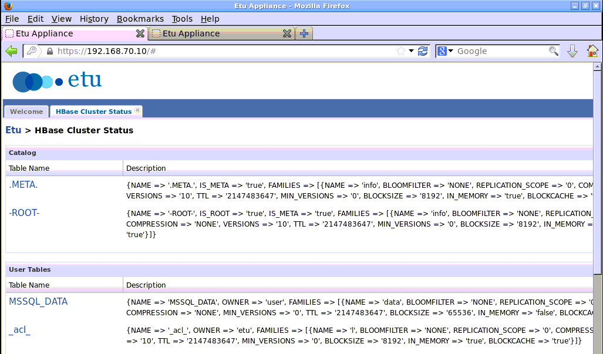

## 實作五

## Sqoop (5) : 將 MS SQL 資料表匯入 HBase

### 執行記錄匯入

1. 請輸入如下指令並將「帳號」處替換成您的帳號：
<pre>
user@master ~ $ export DBID=帳號
user@master ~ $ sqoop import --connect "jdbc:sqlserver://sql.3du.me;database=$DBID" --table MSSQL_DATA --username $DBID -P --hbase-row-key id --hbase-create-table --column-family data --hbase-table ms_$DBID
Enter password: 輸入密碼
</pre>
1. 若資料表匯入有正常執行，您將看到以下的類似訊息：
<pre>
13/12/22 15:51:19 INFO manager.SqlManager: Using default fetchSize of 1000
13/12/22 15:51:19 INFO tool.CodeGenTool: Beginning code generation
13/12/22 15:51:20 INFO manager.SqlManager: Executing SQL statement: SELECT t.* FROM [MSSQL_DATA] AS t WHERE 1=0
13/12/22 15:51:20 INFO orm.CompilationManager: HADOOP_HOME is /opt/hadoopmr
Note: /tmp/sqoop-user/compile/24981ba074b67292d219153cf6e3b770/MSSQL_DATA.java uses or overrides a deprecated API.
Note: Recompile with -Xlint:deprecation for details.
13/12/22 15:51:23 INFO orm.CompilationManager: Writing jar file: /tmp/sqoop-user/compile/24981ba074b67292d219153cf6e3b770/MSSQL_DATA.jar
13/12/22 15:51:23 INFO mapreduce.ImportJobBase: Beginning import of ms_$DBID
... 略 ...
13/12/22 15:52:51 INFO mapreduce.ImportJobBase: Retrieved 2 records.
</pre>

### 檢查匯入結果

1. 轉換之結果，可於 HBase 儲存於 HDFS 的路徑查到。
<pre>
user@master ~ $ hadoop fs -ls /hbase/ms_$DBID
No encryption was performed by peer.
Found 3 items
-rw-------   3 etu supergroup        559 2013-12-22 15:51 /hbase/ms_$DBID/.tableinfo.0000000001
drwxr-xr-x   - etu supergroup          0 2013-12-22 15:51 /hbase/ms_$DBID/.tmp
drwx------   - etu supergroup          0 2013-12-22 15:51 /hbase/ms_$DBID/1f0078cc9341be82f7137b8009f8fb9e
</pre>
1. 您也可以透過 Etu Appliance 的管理介面觀察 HBase 資料表的狀態。
    * 

### 參考資料

1. "[Sqoop: Big data conduit between NoSQL and RDBMS](http://www.ibm.com/developerworks/library/bd-sqoop/index.html)", [Surajit Paul](mailto:surajit.paul@in.ibm.com), Advisory Consultant, IBM, 23 Jul 2013

--------------------
本文件最後更新於：
