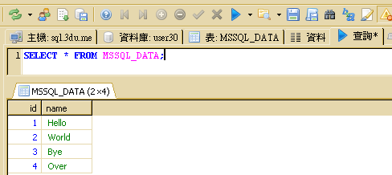

## 實作七

## Sqoop (7) : 將 HDFS 資料匯出到 MS SQL 資料表

### 建立 HDFS 示範資料

1. 產生兩筆資料的檔案，上傳到 HDFS
<pre>
user@master ~ $ hadoop fs -mkdir export
user@master ~ $ cat >> data << EOF
3,Bye
4,Over
EOF
user@master ~ $ hadoop fs -put data export
user@master ~ $ hadoop fs -cat export/data
3,Bye
4,Over
</pre>

### 執行資料匯出

1. 請輸入如下指令：
<pre>
user@master ~ $ export DBID=帳號
user@master ~ $ sqoop export --connect "jdbc:sqlserver://sql.3du.me;database=$DBID" --table MSSQL_DATA --username $DBID -P --export-dir /user/$(whoami)/export
Enter password: 輸入密碼
</pre>
1. 若資料匯出有正常執行，您將看到以下的類似訊息：
<pre>
13/12/22 14:40:41 INFO manager.SqlManager: Using default fetchSize of 1000
13/12/22 14:40:41 INFO tool.CodeGenTool: Beginning code generation
13/12/22 14:40:42 INFO manager.SqlManager: Executing SQL statement: SELECT t.* FROM [MSSQL_DATA] AS t WHERE 1=0
13/12/22 14:40:43 INFO orm.CompilationManager: HADOOP_HOME is /opt/hadoopmr
... 略 ...
13/12/22 14:41:35 INFO mapreduce.ExportJobBase: Transferred 0 bytes in 47.51 seconds (0 bytes/sec)
13/12/22 14:41:35 INFO mapreduce.ExportJobBase: Exported 2 records.
</pre>

### 檢查匯出結果

1. 轉換之結果，請執行 heidisql.exe 執行檔，連線到 Microsoft SQL Server，輸入以下 SQL 語法，並按下「查詢」按鈕。
<pre>
SELECT * FROM MSSQL_DATA;
</pre>
   由 HDFS 匯出到 MSSQL_DATA 資料表的結果：(多出兩筆記錄)
   

### 參考資料

1. "[Sqoop: Big data conduit between NoSQL and RDBMS](http://www.ibm.com/developerworks/library/bd-sqoop/index.html)", [Surajit Paul](mailto:surajit.paul@in.ibm.com), Advisory Consultant, IBM, 23 Jul 2013

--------------------
本文件最後更新於：
