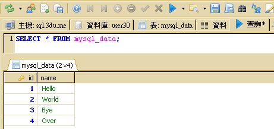

## 實作八

## Sqoop (8) : 將 HDFS 資料匯出到 MySQL 資料表

### 建立 HDFS 示範資料

1. 為了節省步驟，我們將使用 Sqoop (7) 產生的兩筆記錄。若您的 HDFS 上沒有 export 這個目錄，請再執行一次以下步驟：
<pre>
user@master ~ $ hadoop fs -mkdir export
user@master ~ $ cat >> data << EOF
3,Bye
4,Over
EOF
user@master ~ $ hadoop fs -put data export
user@master ~ $ hadoop fs -cat export/data
3,Bye
4,Over
</pre>

### 執行資料匯出

1. 請輸入如下指令：
<pre>
user@master ~ $ export DBID=帳號
user@master ~ $ sqoop export --connect "jdbc:mysql://sql.3du.me/$DBID" --table mysql_data --username $DBID -P --export-dir /user/$(whoami)/export
Enter password: 輸入密碼
</pre>
1. 若資料匯出有正常執行，您將看到以下的類似訊息：
<pre>
13/12/22 16:29:23 INFO manager.MySQLManager: Preparing to use a MySQL streaming resultset.
13/12/22 16:29:23 INFO tool.CodeGenTool: Beginning code generation
13/12/22 16:29:24 INFO manager.SqlManager: Executing SQL statement: SELECT t.* FROM `mysql_data` AS t LIMIT 1
13/12/22 16:29:24 INFO manager.SqlManager: Executing SQL statement: SELECT t.* FROM `mysql_data` AS t LIMIT 1
13/12/22 16:29:24 INFO orm.CompilationManager: HADOOP_HOME is /opt/hadoopmr
Note: /tmp/sqoop-user/compile/4a779990485334d9fa5f40df04c399de/mysql_data.java uses or overrides a deprecated API.
Note: Recompile with -Xlint:deprecation for details.
13/12/22 16:29:27 INFO orm.CompilationManager: Writing jar file: /tmp/sqoop-user/compile/4a779990485334d9fa5f40df04c399de/mysql_data.jar
13/12/22 16:29:27 INFO mapreduce.ExportJobBase: Beginning export of mysql_data
... 略 ...
13/12/22 16:30:41 INFO mapreduce.ExportJobBase: Transferred 0 bytes in 71.6721 seconds (0 bytes/sec)
13/12/22 16:30:41 INFO mapreduce.ExportJobBase: Exported 2 records.
</pre>

### 檢查匯出結果

1. 轉換之結果，請執行 heidisql.exe 執行檔，連線到 MySQL Server，輸入以下 SQL 語法，並按下「查詢」按鈕。
<pre>
SELECT * FROM mysql_data;
</pre>
   由 HDFS 匯出到 mysql_data 資料表的結果：(多出兩筆記錄)
   

### 參考資料

1. "[Sqoop: Big data conduit between NoSQL and RDBMS](http://www.ibm.com/developerworks/library/bd-sqoop/index.html)", [Surajit Paul](mailto:surajit.paul@in.ibm.com), Advisory Consultant, IBM, 23 Jul 2013

--------------------
本文件最後更新於：
